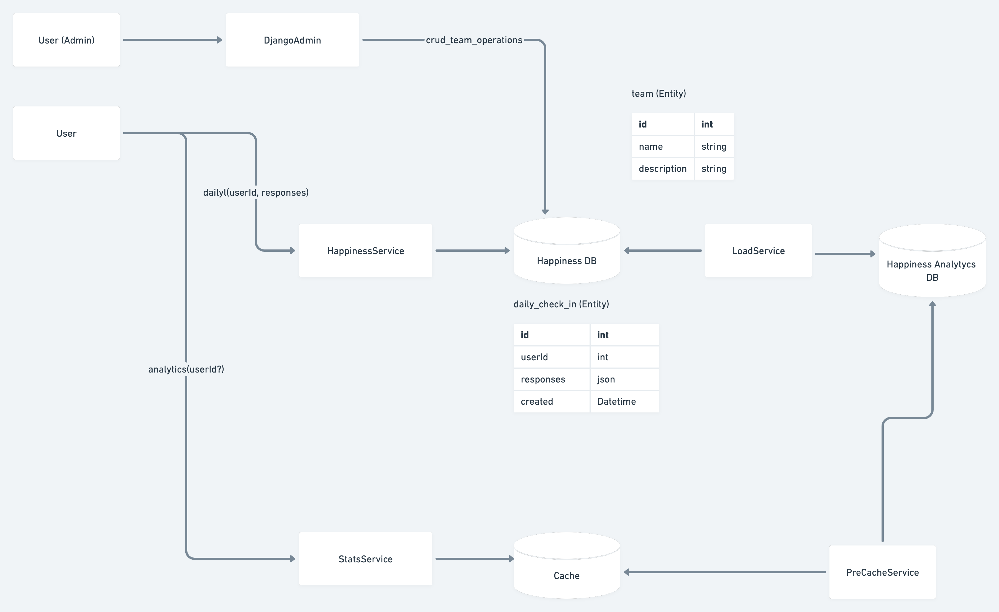

# d1g1t-backend-assignment

D1g1t Backend Test Assignment


<!-- TOC -->

* [d1g1t-backend-assignment](#d1g1t-backend-assignment)

<!-- TOC -->

## Features


## Method

The method chosen to measure Happiness
was [The Satisfaction with Life Scale (SWLS)](https://en.wikipedia.org/wiki/Life_satisfaction) uses a scale of 1 to 7,
where 1 represents "strongly disagree," and 7 represents "strongly agree" for statements such as "In most ways, my life
is close to my ideal."

### The levels of happiness have the following ranges:

* 31 - 35 Extremely happy
* 26 - 30 happy
* 21 - 25 Slightly happy
* 20 Neutral
* 15 - 19 Slightly unhappy
* 10 - 14 unhappy
* 5 - 9 Extremely unhappy

## High Level Solution Design



## Prerequisites

You need to install [Docker Desktop](https://www.docker.com/products/docker-desktop)
and [Docker Compose](https://docs.docker.com/compose/install/) before following the instructions below.

To install Docker Desktop on Windows Home, please follow
the [instructions](https://docs.docker.com/docker-for-windows/install-windows-home/).

## Installation

## Endpoints

### Authentication

[JSON Web Token Authentication](https://www.django-rest-framework.org/api-guide/authentication/#json-web-token-authentication)

```shell
curl --request POST \
  --url http://localhost:8000/api/token/ \
  --header 'Content-Type: application/json' \
  --data '{
"username": "<username>",
"password": "<password>"
}'

```

#### Response

```json
{
  "refresh": "<generated token>",
  "access": "<generated token>"
}
```

### CREATE Daily Check-in /daily/v1/api/

#### The score is calculated by summing up the responses to the following questions/criteria:

* __ In most ways my life is close to my ideal.
* __ The conditions of my life are excellent.
* __ I am satisfied with my life.
* __ So far I have gotten the important things I want in life.
* __ If I could live my life over, I would change almost nothing.

#### The scale (responses):

* 7 - Strongly agree
* 6 - Agree
* 5 - Slightly agree
* 4 - Neither agree nor disagree
* 3 - Slightly disagree
* 2 - Disagree
* 1 - Strongly disagree

#### Example

```shell
curl --request POST \
  --url http://localhost:8000/daily/v1/api/ \
  --header 'Authorization: Bearer <generated token>' \
  --header 'Content-Type: application/json' \
  --data '{
"responses": [6,6,6,5,6]
}'

```

### GET Analytics /analytics/v1/api/

### Authenticated User

```shell
curl --request GET \
  --url http://localhost:8000/analytics/v1/api/ \
  --header 'Authorization: Bearer <token>'

```

#### Response

```json
[
  {
    "name": "team_3",
    "team_statistics": [
      {
        "number_of_people": 1,
        "average_happiness": 29.0,
        "level_happiness": "Happy"
      },
      {
        "number_of_people": 1,
        "average_happiness": 22.0,
        "level_happiness": "Slightly Happy"
      }
    ],
    "average_happiness": 25.5
  }
]
```

### Analytics (Anonymous User)

```shell
curl --request GET \
  --url http://localhost:8000/analytics/v1/api/

```

#### Response

## Improvements